# Simple Ecommerce

- [Business Requirements](#business-requirenments)
- [Database Schema](#database-schema)
- [Backend Endpoints](#backend-endpoints)
- [Challenges](#challenges)
- [Screenshots](#screenshot)
- [Helpful Commands](#helpful-commands)
- [Tools and Langauges](#tools-and-langauges)
- [Improvements](#improvements)

## Business Requirenments
- `Admin` can create products, `user` can buy products
- Each `product` has its `parts` and `options`.
- `Product` can have more than one `part`.
- Each `Part` can have more than one `options`.
- Each product can have its roles in Custom Price and Prohibited Combinations.
- `Custom Price` is added if the user selected two or more options that need more cost.
- `Prohibited Combination` added from the admin side, to check and validate that user can not select these cominations.

## Database Schema 
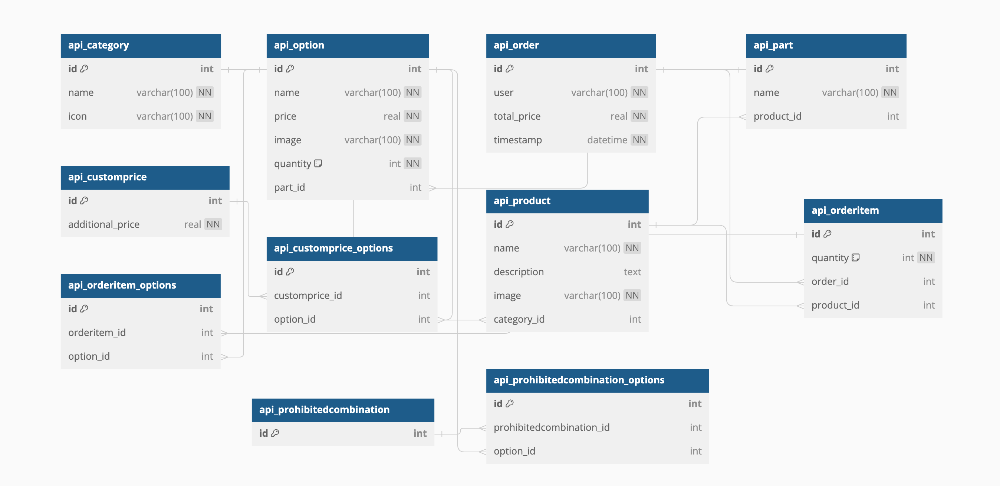

## Backend Endpoints
- ``Swagger URL-> http://localhost:8000/swagger/``
- Category endpoints

- Product endpoints

- Part endpoints

- Option endpoints

- Custom Price endpoints

- Prohibited Combinations endpoints

- Order (checkout) endpoint

## Challenges
- Frontend Side
  - All the frontend stuff :joy
- Backend Side
  - Handling race conditions in purchasing a new product
  - Designing database to make tha admin able to add more than product 

## ScreenShot
- Create product step
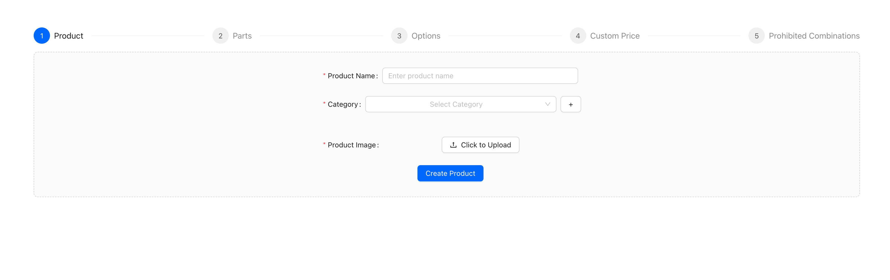
- Create part step
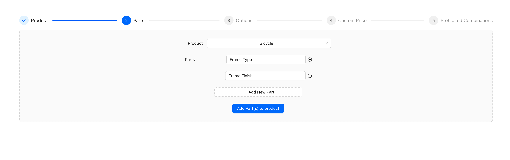
- Create options step
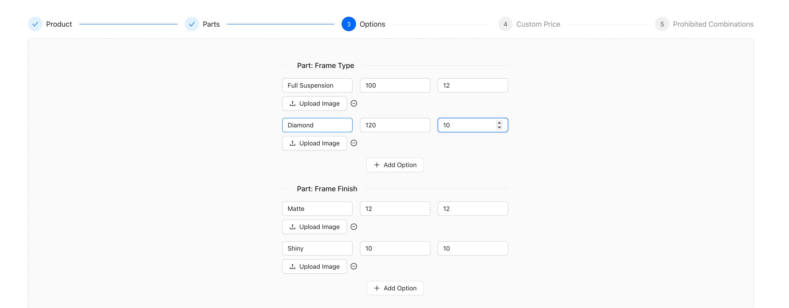
- Create custom price step
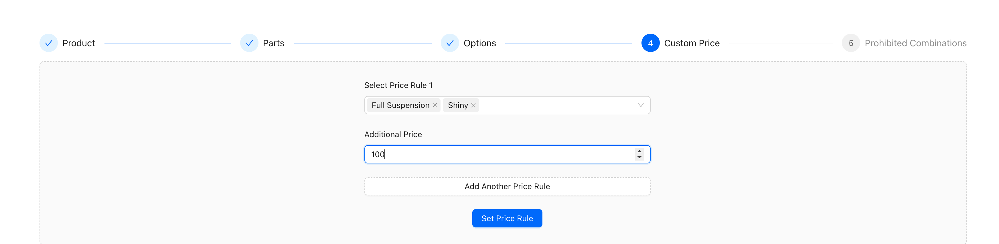
- Create prohibited combinations step
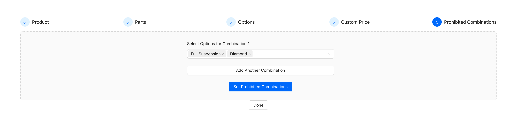
- Cart and Checkout
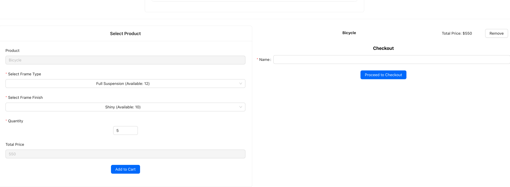
- Login (Note: login is used for admin only to create products)
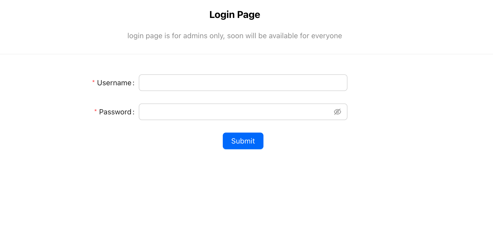
- Product list
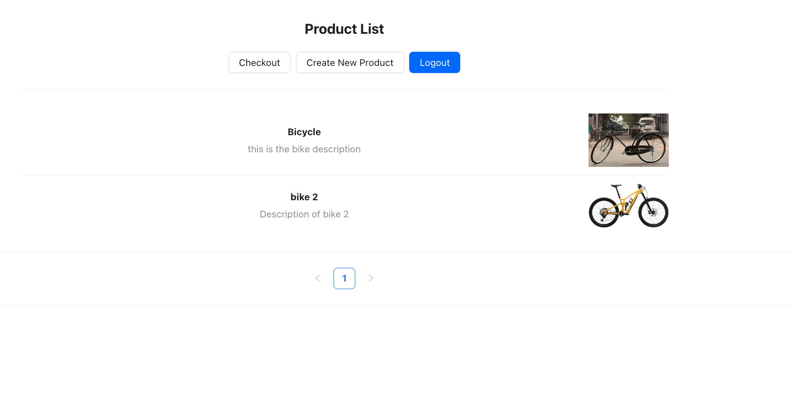
- Product details
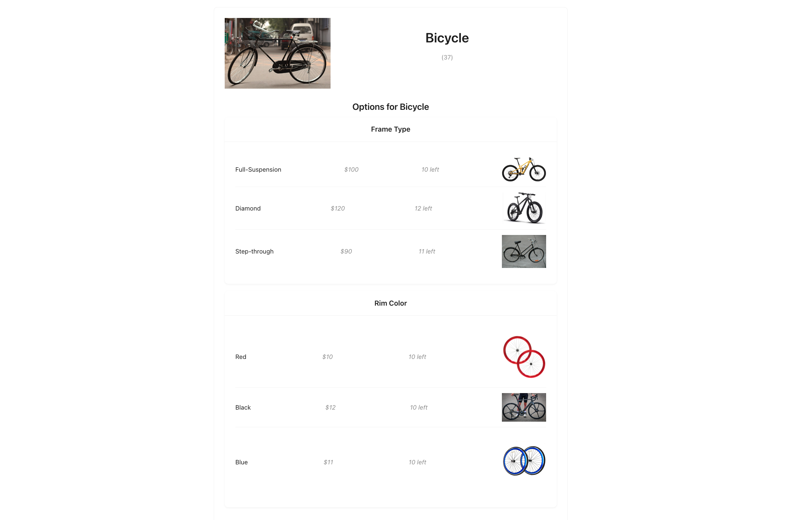
## helpful commands
- Command to run unit test
``
make test
``
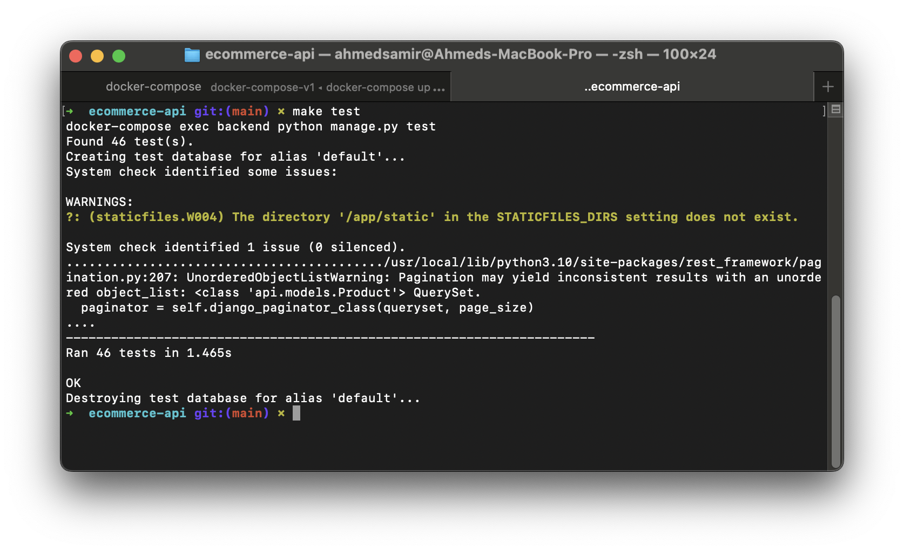

- Command to load data (fixtures)
``
make loaddata
``
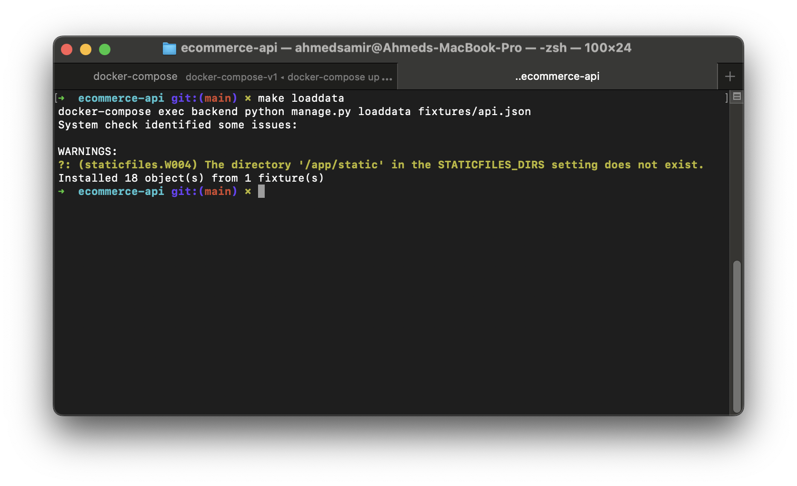
- Command to create super user (admin)
``
make superuser
``
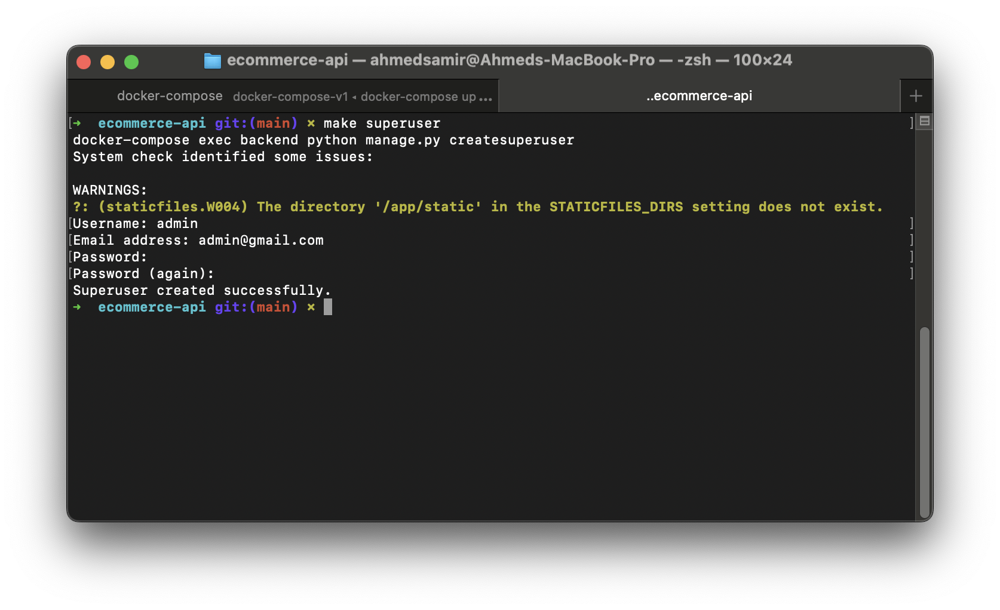
## Tools and Langauges
- Backend
  - Python
  - Django
  - Django Rest Framework
- Frontend
  - JavaScript
  - React JS
- Containerzation
  - Docker
- Documentation
  - Swagger

## Improvements
- Frontend UI
- Each product can have more than 1 image
- Each option can have more than 1 image
- Authentication and Authorization (User Roles)
- Enhance and improve structure of the unit test (FakeRepo) for testing
- Add Account model for every user (to check balance before purchasing product)