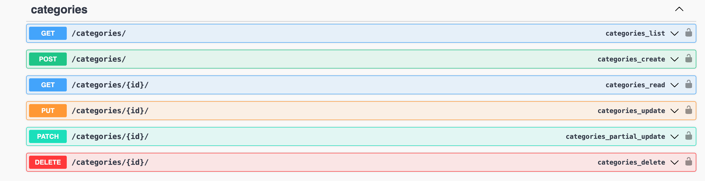
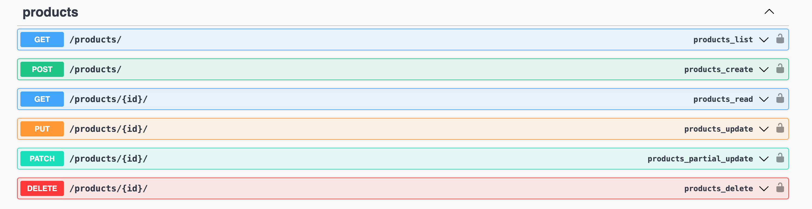
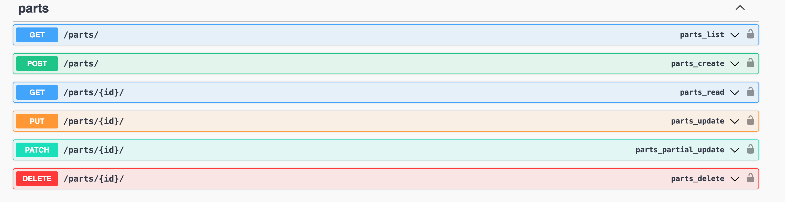
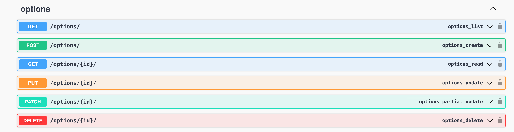
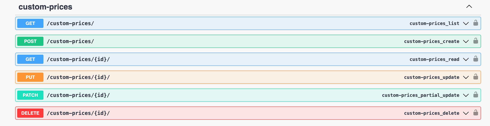
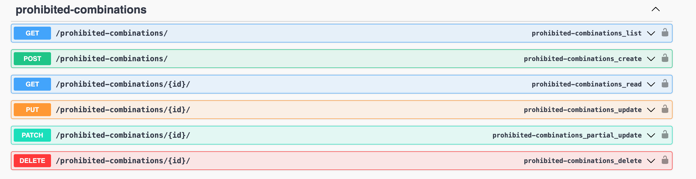
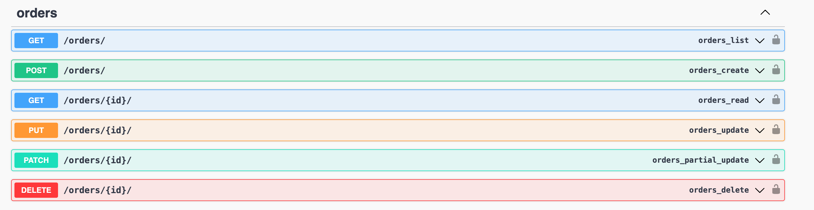

# Simple Ecommerce

- [Business Requirements](#business-requirenments)
- [Database Schema](#database-schema)
- [Backend Endpoints](#backend-endpoints)
- [Challenges](#challenges)
- [Screenshots](#screenshot)
- [Tools and Langauges](#tools-and-langauges)
- [Improvements](#improvements)

## Business Requirenments
- `Admin` can create products, `user` can purchase buy products
- Each `product` has its `parts` and `options`.
- `Product` can have more than one `part`.
- Each `Part` can have more than one `options`.
- Each product can have its roles in Custom Price and Prohibited Combinations.
- `Custom Price` is added if the user selected two or more options that need more cost.
- `Prohibited Combination` added from the admin side, to check and validate that user can not select these cominations.

## Database Schema 
- Still in progress

## Backend Endpoints
- ``Swagger URL-> http://localhost:8000/swagger/``
- Category endpoints

- Product endpoints

- Part endpoints

- Option endpoints

- Custom Price endpoints

- Prohibited Combinations endpoints

- Order (checkout) endpoint

## Challenges
- Frontend Side
  - All the frontend stuff :joy
- Backend Side
  - Handling race conditions in purchasing a new product

## ScreenShot
- Still not ready yet.

## Tools and Langauges
- Python
- Django Rest Framework
- JavaScript
- React JS
- Docker
- Swagger

## Improvements
- Frontend UI
- Each product can have more than 1 image
- Each option can have more than 1 image
